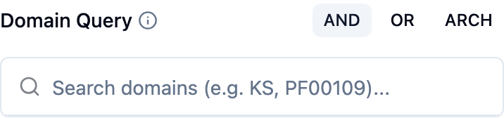

The **Domain** search matches iBGCs on their [protein domains](key-concepts.qmd#protein-domains) — the functional units (Pfam/InterPro) that make up biosynthetic enzymes. Use it when you can describe a cluster by its machinery: "polyketide synthase plus a halogenase", "an adenylation domain but no condensation domain", or a specific ordered domain run.

Open the **Domain Query** builder from the domain chip. It has three modes, selected with the **AND / OR / ARCH** toggle.



## Boolean modes: AND and OR

In AND/OR mode you build a set of domain conditions:

1. Search for a domain by accession or name (for example `PF00109`, or `KS`). Matching domains list with their hit counts.
2. Click one to add it as a condition. By default it is **required**.
3. Click a condition to toggle it between **required** (`+ req`) and **excluded** (`− excl`), or remove it.

Then the mode decides how the required conditions combine:

- **AND** — an iBGC must contain *all* required domains (and none of the excluded ones).
- **OR** — an iBGC must contain *any* of the required domains (and none of the excluded ones).

This is the mode for presence/absence questions: "clusters with both a KS and an AT domain" (AND), or "clusters with any lanthipeptide cyclase" (OR). Excluded domains let you carve away families you are not interested in.

## Architecture mode (ARCH)

Architecture mode matches the *ordered arrangement* of domains, not just their presence. Paste a comma-separated list of domain accessions in the order they occur along the protein/cluster, for example:

```
PF00109, PF02801, PF00501, PF08659
```

The search then ranks iBGCs by how closely their domain architecture resembles yours. Unknown accessions are silently dropped, and a token counter shows how many were parsed.

A **weight slider** balances the two ingredients of the architecture score:

- towards **Sørensen–Dice** — reward sharing the same *set* of domains;
- towards **Adjacency Index** — reward the same *neighbouring pairs* (the order/arrangement).

Set it towards Dice when membership matters most, towards Adjacency when the order of domains is the point. The default is balanced. See [Scores & Metrics](scores-metrics.qmd) for how these combine.

## Running and reading results

The search runs on **Run Query** and combines with any active filters and other conditions. Results sort by domain similarity, and the roster's similarity column shows the **domain match (Dice)** score. On the [Variables map](variables-map.qmd) you can put **Domain match (Dice)** on an axis.

## Tips

- Start broad (one or two AND domains) and tighten with excluded domains rather than adding many required ones at once.
- Use the [protein panel](protein-panel.qmd) on a known cluster to read off the exact domain accessions, then paste them into architecture mode to find relatives.

## Related pages

- [Search Overview](search-overview.qmd) · [Find Similar iBGCs](similar-ibgc.qmd)
- [Protein Panel](protein-panel.qmd) — where to find domain accessions
- [Scores & Metrics](scores-metrics.qmd)
