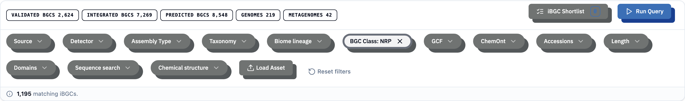

A query is built from **filter chips** in the top strip. Each chip adds one restriction; chips combine, so the result is everything matching *all* of them. Nothing is fetched until you press **Run Query**.

There are two kinds of chip:

- **Metadata filters** narrow the catalogue by attributes that are already stored (taxonomy, biome, class, …). They are fast and can be combined freely.
- **Advanced search chips** run a computation — match by protein domain, protein sequence, or chemical structure. These are covered under [Searching](search-overview.qmd).

## Metadata filters

| Chip | Narrows by |
|------|-----------|
| **Source** | The data collection an assembly came from (e.g. a marine catalogue, BacDive, MIBiG). See [What's in the Catalogue](datasets.qmd). |
| **Detector** | The BGC detection tool that called the cluster (antiSMASH, GECCO, SanntiS). |
| **Assembly type** | Genome, metagenome, or region. |
| **Taxonomy** | A hierarchical tree from domain down to species. Pick at any level. |
| **Biome** | The environment the assembly came from, using the [GOLD biome ontology](biome-ontology.qmd). |
| **BGC class** | The kind of biosynthetic machinery — [Polyketide, NRPS, RiPP, …](bgc-classes.qmd) |
| **GCF** | A [gene cluster family](gcf-explained.qmd) path and its descendants. |
| **ChemOnt class** | The predicted [chemical class](chemont.qmd) of the product. |
| **Accessions** | A single smart field that accepts an assembly, contig, BGC, iBGC, or protein accession. See [Accessions Field](accessions.qmd). |
| **Length** | A minimum/maximum cluster size. |

Each active chip shows a count of selected values; clear it from the chip or use **Reset filters** to clear everything.

## How filters combine

All chips are combined with **AND**: an iBGC must satisfy every active chip to appear. Within a single hierarchical chip (taxonomy, biome, GCF, ChemOnt), selecting a node includes that node and everything below it.

Advanced search chips are combined with the metadata filters too — for example, you can run a [sequence search](sequence-search.qmd) *restricted* to marine Actinomycetota by adding those metadata chips alongside the sequence chip.

## Running, clearing, and result scope

- **Run Query** fetches the matches and reports the count in a banner.
- **Clear query** removes the result set; the label is context-aware (it also clears an active search or loaded asset).
- If a query matches more iBGCs than the discovery platform can display at once, it shows a representative sample and tells you the true total. Narrow the filters for a complete set.

## Filters carry into clicks

Clicking the **GCF** chip inside an [iBGC detail](ibgc-detail.qmd) card applies that family as a filter — a quick way to pivot from one interesting cluster to its whole family.

## Related pages

- [Accessions Field](accessions.qmd)
- [Search Overview](search-overview.qmd) — the advanced chips
- [Load Asset](load-asset.qmd)
- [Taxonomy](glossary.qmd) · [Biome Ontology](biome-ontology.qmd) · [BGC Classes](bgc-classes.qmd) · [ChemOnt](chemont.qmd)
