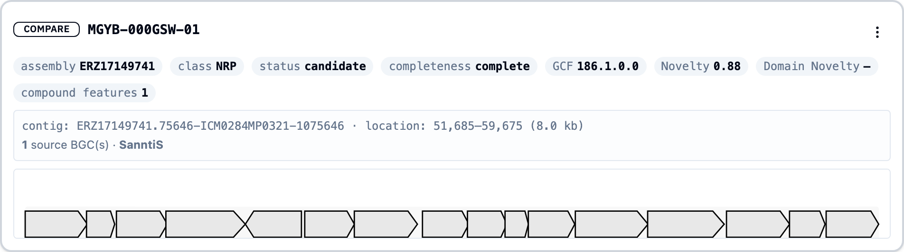

When you select an iBGC, its detail card appears on the right of the discovery platform. There are two such cards, with identical layouts:

- **Reference** (top) — the iBGC you pin with **right-click → Set as reference iBGC**. It stays put while you browse other candidates.
- **Compare** (middle) — updates every time you **left-click** an iBGC in the roster or on a map.

Together they let you hold one cluster fixed and read others against it.

## What the card shows

### Header

The iBGC accession, a **Reference** / **Compare** badge, a **Type Strain** badge where applicable, and an actions menu (set as reference, find similar, add to shortlist).

### Attribute chips

A row of chips summarises the cluster:

| Chip | Meaning |
|------|---------|
| **assembly** | Parent assembly accession — links out to its source page when available. |
| **class** | The normalised [BGC class](bgc-classes.qmd). |
| **status** | `validated` (experimentally characterised reference) or `candidate`. |
| **completeness** | `complete`, or `partial` if the cluster runs off the contig edge. |
| **GCF** | The gene cluster family path (e.g. `42.7.3`). **Click it** to filter the whole discovery platform to that family and its descendants. |
| **Novelty** | Distance from the nearest validated cluster. |
| **Domain Novelty** | Fraction of domains unique within the GCF. |
| **compound features** | Count of predicted/curated compound features. Hover for the list; click to open the structure in MolView when a SMILES is available. |

### Location and sources

A line gives the **contig**, the cluster's **start–end** coordinates and size, the number of **source BGC predictions** it consolidates, and the **tools** that produced them.

### Region plot

A gene-level diagram of the cluster: each arrow is a protein-coding gene (CDS). **Click any gene** to load its protein — sequence and domain annotations — into the [Protein Information panel](protein-panel.qmd) at the bottom of the discovery platform.

## Compound features in detail

The "compound features" chip combines two kinds of chemistry prediction, shown in its hover tooltip:

- **Curated compounds** — for validated iBGCs, the named product(s) and their natural-product class path (from sources such as MIBiG).
- **CHAMOIS ChemOnt classes** — chemical classes predicted from the cluster's proteins and aggregated across its genes, shown as a small tree with the number of contributing genes and a confidence percentage. See [ChemOnt](chemont.qmd).

## Using the two panels together

A typical comparison:

1. Find a promising cluster and **right-click → Set as reference iBGC**. It pins to the top.
2. **Left-click** through similar candidates (or use [Find similar iBGCs](similar-ibgc.qmd)); each loads into the Compare card.
3. Read class, GCF, novelty, size, and predicted chemistry against the reference.
4. Click into individual genes to confirm the domain architecture in the [protein panel](protein-panel.qmd).
5. Add the keepers to your [shortlist](shortlists.qmd).

## Related pages

- [Protein Panel](protein-panel.qmd)
- [Scores & Metrics](scores-metrics.qmd) · [BGC Classes](bgc-classes.qmd) · [ChemOnt](chemont.qmd)
- [Find Similar iBGCs](similar-ibgc.qmd)
