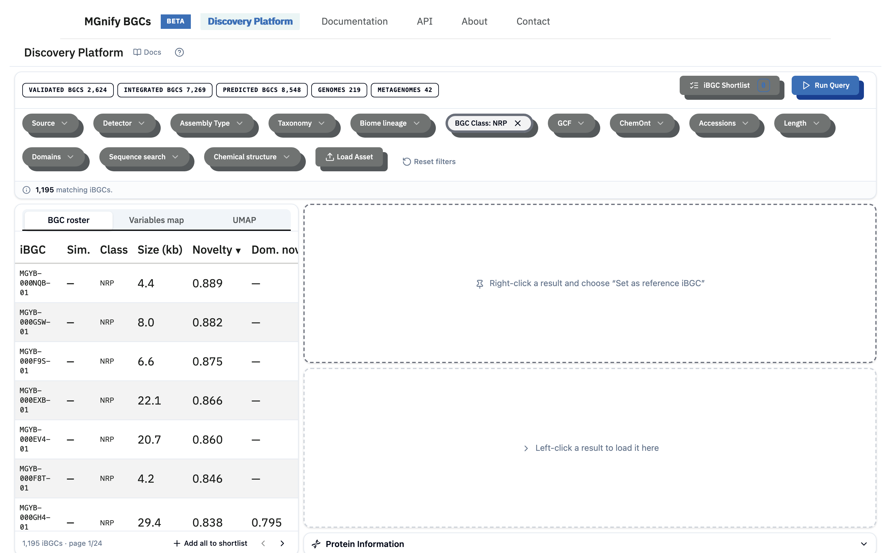

## What the platform does

The MGnify BGCs Discovery Platform helps you find biosynthetic gene clusters (BGCs) worth detailed analysis or experimental work. It holds a large catalogue of BGCs detected in public genomes and metagenomes, each scored for novelty. You filter, search, compare, and shortlist candidates in one place, and you can upload your own BGC predictions to compare them against the catalogue.

## Collection of integrated BGC predictions (iBGC)

Different BGC detection tools (antiSMASH, GECCO, SanntiS) often disagree about the exact boundaries of a cluster, and the same region can be called more than once. To give you one clean record instead of several overlapping predictions, the platform consolidates overlapping predictions on the same contig into a single **integrated BGC (iBGC)**.

The iBGC is the unit you work with everywhere in the discovery platform — it is what the **BGC Roster** lists, what the maps plot, what you score, compare, and shortlist. Each iBGC keeps a record of the source predictions it was built from and the tools that called them. See [Key Concepts](key-concepts.qmd) for the full vocabulary.

## How you work: query → triage → shortlist → export

The discovery platform follows one workflow:

1. **Build a query.** Add filter chips to narrow the catalogue by taxonomy, biome, BGC class, chemical class, gene cluster family, and more. For a targeted search, add an advanced chip — by protein domain, protein sequence, or chemical structure. You can also [load your own assembly](load-asset.qmd) and project it into the catalogue for comparison.
2. **Run the query.** Nothing loads until you press **Run Query**. A banner then reports how many iBGCs match.
3. **Triage the matches.** Results appear three ways: the [**BGC Roster**](bgc-roster.qmd) (a sortable table), the [**Variables Map**](variables-map.qmd) (plot any two metrics against each other), and the [**UMAP**](umap.qmd) (where similar iBGCs cluster together). Sort by **novelty** to surface candidates least like known, validated clusters.
4. **Inspect and compare.** Right-click an iBGC to pin it as a **reference**; left-click others to load them into the **compare** panel beside it. Click any gene to see its protein and domain annotations.
5. **Shortlist and export.** Add the promising iBGCs to your shortlist, then **Generate Report** to materialise it and download GenBank files, tables, or JSON.

## How candidates are scored

Every iBGC carries two novelty measures, both computed from the protein domains its genes encode:

- **Novelty** — how unlike known, experimentally validated clusters the iBGC is. A high value means it resembles nothing in the validated reference set (chiefly [MIBiG](mibig-validated.qmd)).
- **Domain novelty** — how many of the iBGC's protein domains are unique within its own gene cluster family. A high value means the iBGC carries enzymatic machinery its closest relatives do not.

Both are explained in detail on the [Scores & Metrics](scores-metrics.qmd) page. Similarity between clusters is measured from shared protein domains and the way those domains are arranged — not from raw sequence alignment — so functionally related clusters can be matched even when their sequences have diverged.

## Where the data comes from

The catalogue is assembled from public genomic resources and an in-house annotation pipeline:

- **Genomes and metagenomes** from MGnify, GTDB, BacDive type-strain isolates, and other public collections.
- **Validated BGCs** from MIBiG, which provide the known reference points that novelty is measured against.

Each assembly is run through the annotation pipeline (gene calling → domain annotation → BGC detection → chemical-class prediction), and the resulting BGCs are integrated, clustered into families, and scored. See [How the Data Is Built](how-data-is-built.qmd) for the methods and [What's in the Catalogue](datasets.qmd) for the current data sources (marine focus).

## Where to go next

- **New here?** Read [Key Concepts](key-concepts.qmd), then follow the [Quickstart](quickstart.qmd).
- **Want the discovery platform layout?** See the [Discovery Platform Overview](dashboard-overview.qmd).
- **Have a specific target?** See [Search Overview](search-overview.qmd) for domain, sequence, and chemical searches.
- **Want to understand the scores?** Read [Scores & Metrics](scores-metrics.qmd).
- **Curious about the data?** See [How the Data Is Built](how-data-is-built.qmd) and [What's in the Catalogue](datasets.qmd).
