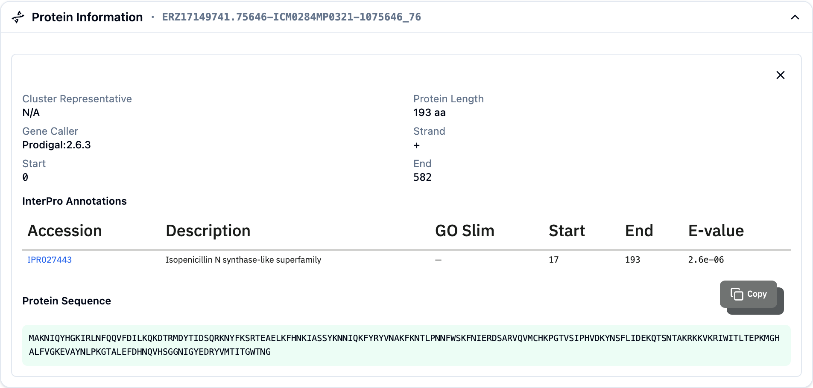

The **Protein Information** panel sits at the bottom of the discovery platform and shows the detail of a single gene. It fills in when you **click a gene (CDS)** in the region plot of either the [Reference or Compare](ibgc-detail.qmd) iBGC card. The panel is collapsible — open it when you want to verify a cluster's enzymatic machinery gene by gene.

## What it shows

### Summary

| Field | Meaning |
|-------|---------|
| **Cluster Representative** | The representative protein this gene maps to, with an outbound link where available. |
| **Protein Length** | Length in amino acids. |
| **Gene Caller** | The gene-prediction tool that called the gene. |
| **Strand** | `+` or `−`. |
| **Start / End** | Coordinates on the contig. |
| **ChemOnt Class** | When predicted: the [ChemOnt](chemont.qmd) chemical class for this protein, with its probability and weight. |

### InterPro annotations

A table of the protein's domain hits — the functional units that make this gene part of a biosynthetic cluster:

- **Accession** — the InterPro/signature accession (links to InterPro).
- **Description** — what the domain is.
- **GO Slim** — a coarse functional category for the domain.
- **Start / End** — where the domain falls within the protein.
- **E-value** — the match confidence.

These domain hits are the same annotations the platform uses to compare clusters and to compute novelty, so this table is where you confirm *why* a cluster was scored or matched the way it was.

### Protein sequence

The full amino-acid sequence, with a **Copy** button so you can paste it straight into a [sequence search](sequence-search.qmd), an alignment, or a primer-design tool.

## Why this matters

For a natural product chemist, the domain table is the most direct read on what a cluster can make. Seeing, for example, a run of ketosynthase / acyltransferase / dehydratase domains confirms a polyketide assembly line; adenylation and condensation domains point to non-ribosomal peptides. The panel lets you go from a scored candidate to the concrete enzymatic evidence behind it.

## Related pages

- [iBGC Detail](ibgc-detail.qmd) — where you click the genes
- [Domain Search](domain-query.qmd) — query the catalogue by these domains
- [Sequence Search](sequence-search.qmd) — paste a copied sequence to find related clusters
- [ChemOnt](chemont.qmd)
