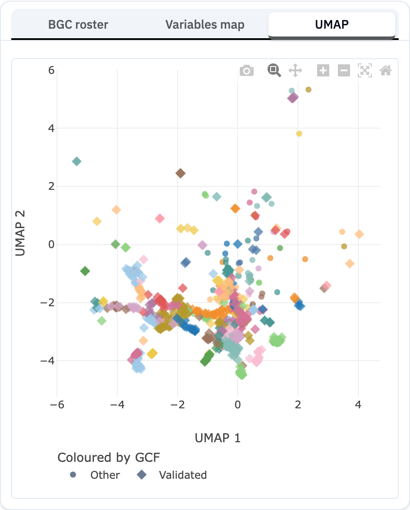

The **UMAP** tab is a two-dimensional map of your matching iBGCs in which **similar clusters sit close together**. Where the [Variables map](variables-map.qmd) plots metrics you choose, the UMAP plots *overall similarity*: it is the view for spotting families, clusters of related candidates, and isolated outliers.

## What the coordinates mean

The map is a projection of the high-dimensional similarity space (shared protein domains and their arrangement) down to two dimensions. The axes themselves have no units — only *proximity* is meaningful. Two iBGCs near each other have similar domain content; two far apart do not.

Points are coloured by gene cluster family ([GCF](gcf-explained.qmd)), so a tight, single-coloured cluster is one family and a sparse, mixed region holds unrelated singletons.

## How to read it for discovery

- **Dense, single-colour clumps** are well-populated families — common biosynthetic strategies.
- **Isolated points** are clusters with few or no close relatives — often the most novel candidates. Cross-check them with the Novelty column in the [roster](bgc-roster.qmd).
- The pinned **reference** iBGC is always drawn so you can see where your anchor falls relative to everything else.

## Complete vs partial clusters

Most iBGCs are placed directly from their own domain content. **Partial** iBGCs — clusters that run off the edge of a contig and may be incomplete — are instead positioned by averaging the coordinates of their nearest complete neighbours. They still appear on the map; treat their exact position as approximate. Partial iBGCs are flagged in the roster and detail panels.

## Interactions

- **Left-click** a point to load it into the [Compare](ibgc-detail.qmd) panel.
- **Right-click** for the actions menu (set as reference, find similar, add to shortlist).

## Related pages

- [Variables Map](variables-map.qmd) · [BGC Roster](bgc-roster.qmd)
- [Gene Cluster Families](gcf-explained.qmd) — what the colours represent
- [Find Similar iBGCs](similar-ibgc.qmd)
