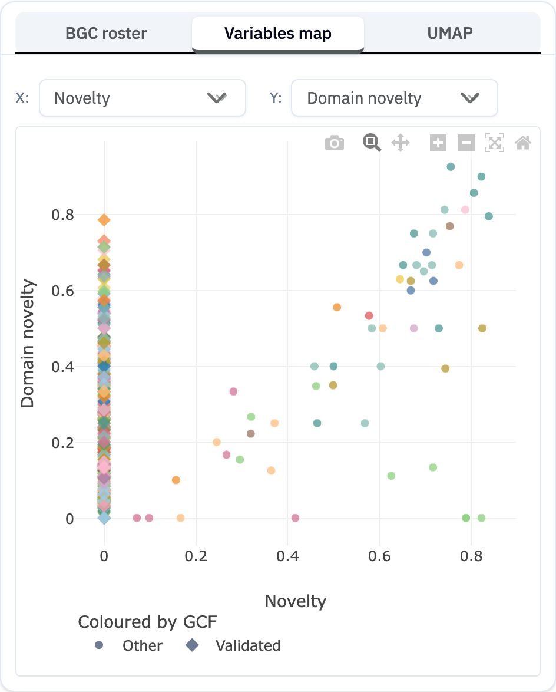

The **Variables map** plots your matching iBGCs as a scatter, with metrics you choose on the X and Y axes. It is the view to use when you want to see *relationships* between attributes — for example, which novel clusters are also large, or how similarity to your query trades off against novelty.

It shows the same result set as the [BGC roster](bgc-roster.qmd) and [UMAP](umap.qmd); only the presentation differs.

## Choosing axes

Two dropdowns above the plot set the X and Y axes. The always-available choices are:

- **Novelty** — distance from the nearest validated cluster.
- **Domain novelty** — fraction of domains unique within the GCF.
- **Size (kb)** — cluster length.
- **# CDS** — number of protein-coding genes.

After you run a search, extra axes become available that carry the query's score:

- **Query similarity** — for a domain or find-similar search (labelled **Domain match (Dice)** for domain searches).
- **Bitscore**, **Identity %**, and **Query coverage %** — for a [sequence search](sequence-search.qmd).

If you pick a query axis without having run a search, the plot prompts you to run one to populate it.

## Reading the plot

- Each point is one iBGC. Points are coloured by gene cluster family, so members of the same GCF share a hue.
- The pinned **reference** iBGC is always drawn, even if it would otherwise be filtered out of the plot — so you can locate your anchor against the cloud.
- **Left-click** a point to load that iBGC into the [Compare](ibgc-detail.qmd) panel; **right-click** for the actions menu (set as reference, find similar, add to shortlist).

## A note on missing points

The map omits iBGCs whose chosen axis value cannot be computed. For example, **domain novelty** is undefined for single-member families, so those iBGCs disappear when domain novelty is on an axis. If a candidate you expect is missing, switch that axis to a metric it has (such as Size or Novelty), or check it in the roster.

## Related pages

- [BGC Roster](bgc-roster.qmd) · [UMAP](umap.qmd)
- [Scores & Metrics](scores-metrics.qmd)
- [Sequence Search](sequence-search.qmd) — the source of the identity/coverage axes
