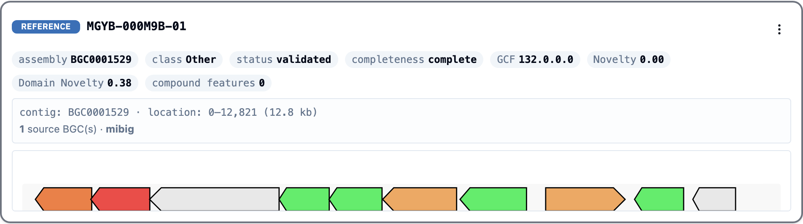
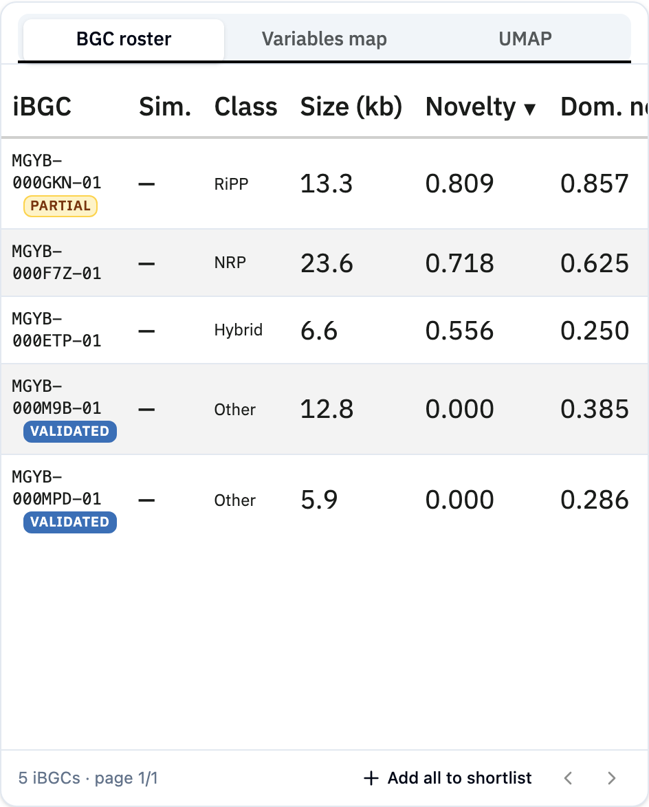
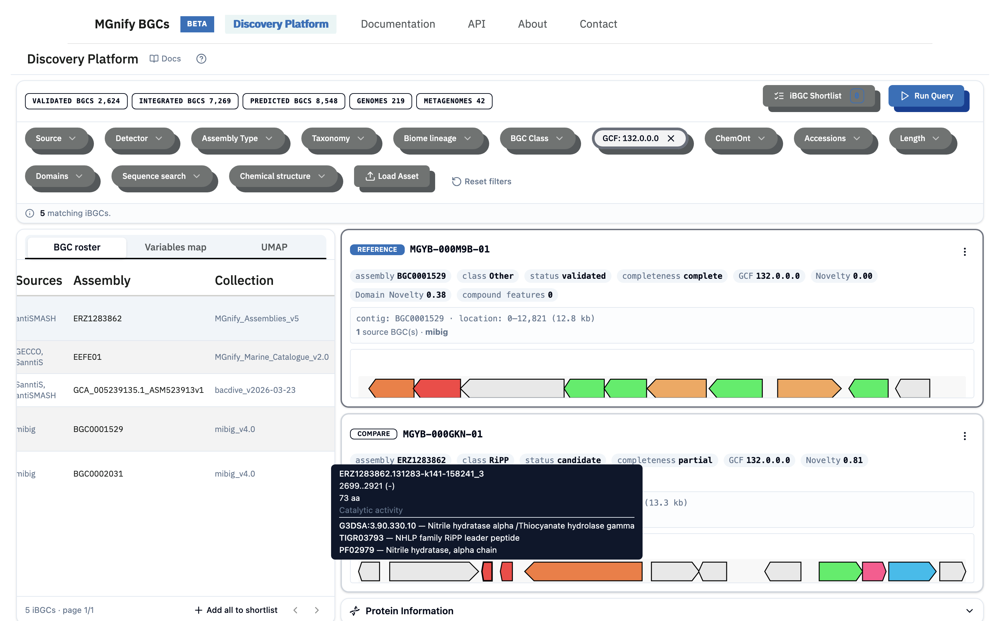
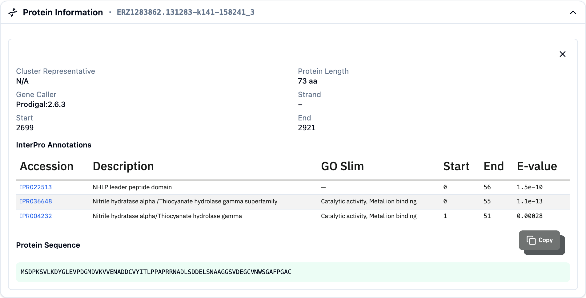
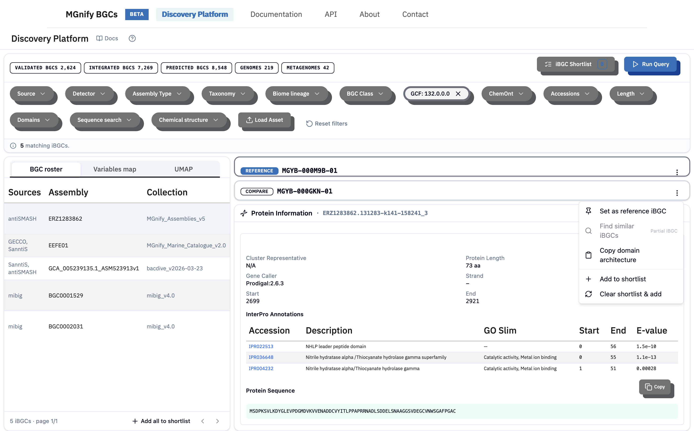
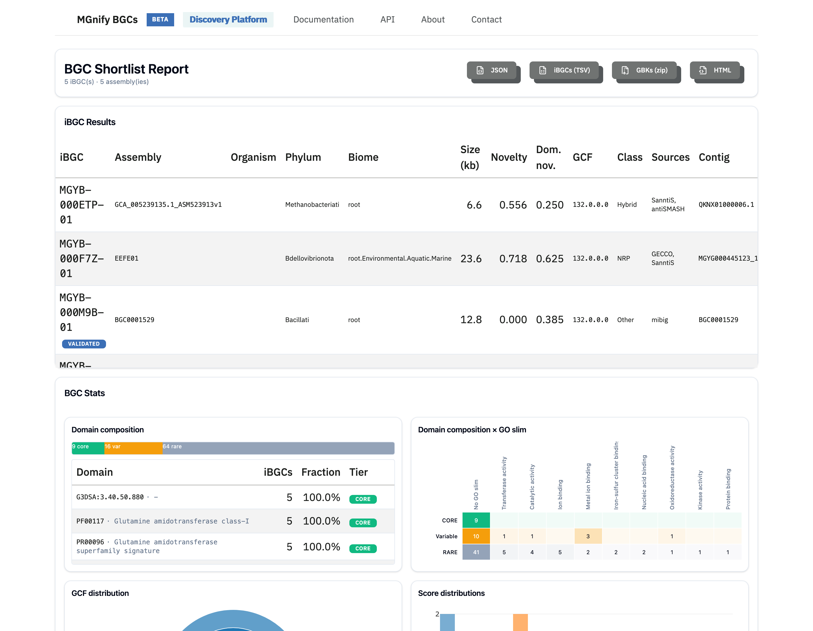

This walkthrough follows one realistic task from start to finish. You have a **known, experimentally validated cluster** — MIBiG entry `BGC0001529` — and you want to find the clusters in the catalogue that are related to it, see which relatives are novel, and learn what the whole family has in common. It is the same path the in-app guided tour takes.

The rationale is the heart of the platform's report: **a single cluster tells you little, but a family of related clusters tells you a lot.** Comparing a known BGC against its relatives shows which parts are conserved (the biosynthetic core every member keeps) and which vary (the tailoring that produces different chemistry) — and surfaces the novel relatives worth pursuing.

For the vocabulary used below, read [Key Concepts](key-concepts.qmd) first.

## Step 1 — Find the known cluster

Open the **Accessions** filter and enter the MIBiG assembly accession `BGC0001529`, then **Run Query**. The platform resolves it to one iBGC, `MGYB-000M9B-01`. **Right-click** the row and choose **Set as reference iBGC** to pin it to the top detail panel.

The reference card confirms what you started with: a **validated** cluster (novelty `0` by definition), and — importantly — its gene cluster family, **GCF 132.0.0.0**.

## Step 2 — Open up its family

**Click the GCF chip** (`GCF 132.0.0.0`) on the reference card. This sets the gene cluster family as a filter. Clear the **Accessions** chip so you are no longer pinned to the single entry, then **Run Query** again.

The roster now lists the whole family — the iBGCs whose domain content groups them with your known cluster. Here that is five members: the two **validated** MIBiG entries (novelty `0`) and three **candidate** clusters from environmental assemblies, with novelty rising to `0.81`. Sort by **Novelty** to bring the most novel relatives to the top.

This is the payoff of the [gene cluster family](gcf-explained.qmd): one click took you from a single known compound to a set of candidates predicted to make related chemistry — some of which no one has characterised.

## Step 3 — Compare the relatives to the known cluster

With `BGC0001529` still pinned as the reference, **left-click** a relative in the roster — start with the most novel, `MGYB-000GKN-01`. It loads into the **Compare** card beside the reference, so you can read the two side by side: class, novelty, completeness, and the gene-level maps.

**Hover** a gene in either map to see its protein domains without leaving the view — a quick way to scan what each cluster encodes.

For the full picture of a gene, **click** it. Its protein loads into the **Protein Information** panel: length, gene caller, every InterPro/Pfam domain, and the copyable sequence. This is where you confirm the enzymatic evidence — for example, that a relative carries the same core biosynthetic domains as the validated cluster but adds tailoring enzymes of its own.

## Step 4 — Shortlist the family

To collect a cluster, open the **kebab menu** (⋮) on its detail card and choose **Add to shortlist**.

Repeat for the relatives worth keeping, or use **Add all to shortlist** in the roster footer to add the whole family at once. The shortlist holds your selection (up to 1,000 iBGCs) in the browser. See [Shortlists](shortlists.qmd).

## Step 5 — Generate the report

Open the shortlist and click **Generate Report**. The report analyses your selected clusters *as a set* — and that is its purpose: **to find the common patterns across similar BGCs and flag the outliers.**

Read it from the top:

- The **iBGC results** table lists every member with its scores, class, assembly, and biome.
- **Domain composition** is the key panel for this task: it tiers each protein domain as **core** (present in most or all members), **variable**, or **rare**. The core domains are the family's shared biosynthetic machinery; the rare ones are where individual relatives diverge.
- **GCF and score distributions**, **completeness**, and the **biome/taxonomy** sunbursts show how broadly the family is spread and how novel its members are.

For this family, the domain composition shows a small set of core domains carried by all five clusters — the conserved heart of the pathway — while the novel relatives add domains the validated entries lack.

## Step 6 — Export for further analysis

Click **GBKs (zip)** in the report header to download a GenBank file per cluster. These are ready for the next step: re-running antiSMASH, aligning the core genes, or designing primers to amplify a candidate from its source organism. See [Export Formats](export-formats.qmd) for the other formats (TSV, JSON, HTML).

## What you've done

You started from one characterised compound, gathered its biosynthetic family, compared the relatives against the known reference, and exported the set — with a clear read on which clusters are novel and what machinery they share. The same path works from any starting point: a [sequence](sequence-search.qmd) or [chemical](chemical-search.qmd) search, a taxonomy or biome [filter](filtering.qmd), or your own [loaded assembly](load-asset.qmd) all lead into the same compare-and-report flow.

## Related pages

- [Quickstart](quickstart.qmd) — the same flow in brief
- [Gene Cluster Families](gcf-explained.qmd) · [iBGC Detail](ibgc-detail.qmd) · [The Report](report.qmd)
- [Export Formats](export-formats.qmd)
